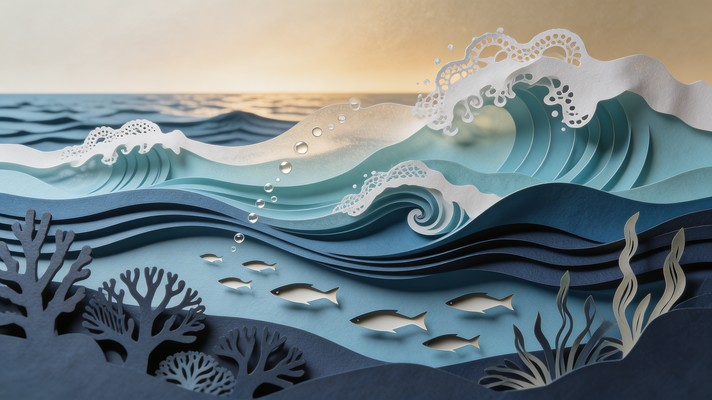

## Hi, let's discuss 👋

### 🌊 An interconnected community

We're an open source community 💗 focused on making on-line conversations easier to follow and understand.

### :seal: Contributing to the ecosystem

We build tools 🔧 to make it easier to communicate effectively when maintaining open source projects.

- [kirigami](https://github.com/pykirigami/kirigami) - A web app that increases understanding of long threads, like PEPs on discuss.python.org, by giving the reader signals and custom views.

*[Layered Ocean Artistry](https://stockcake.com/i/layered-ocean-artistry_4158737_1865821) by [StockCake](https://stockcake.com)*

### 🐳 Motivation

Learn more about our motivation to build these tools in our [docs](https://pykirigami.github.io/kirigami).

### 🐙 How we started

Two years ago, kirigami started with some notebooks and scripts. [@willingc](https://github.com/willingc) had a dream of making long discussions on discuss.python.org easier to understand and follow the flow of ideas.

At PyCon US 2026 in Long Beach, CA, [@DEKHTIARJonathan](https://github.com/DEKHTIARJonathan), @willingc, and other Pythonistas sprinted on making the [web app for kirigami](https://kirigami.fastapicloud.dev) come to life. It's still early days, but we couldn't wait to share it with you. 💕

### 🏖️ Gratitude

Thanks [FastAPI Cloud](https://fastapicloud.com) for hosting the web app.
